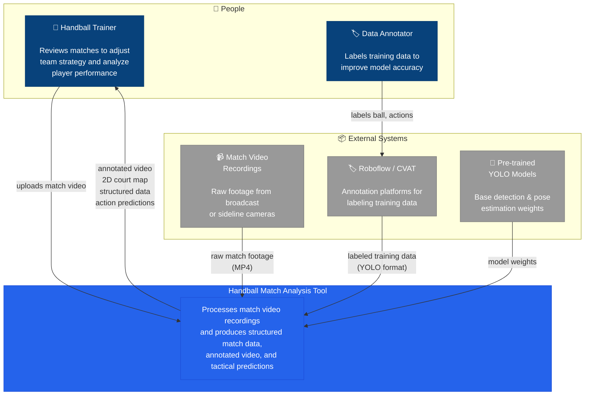

# C4 Context Diagram — Handball Match Analysis Tool

The **Context diagram** (C4 Level 1) shows the system as a single box, the people
who use it, and the external systems it interacts with.

---

## Context Diagram

---

## Elements

| Element | Type | Role |
|---------|------|------|
| **Handball Trainer** | Person (primary user) | Uploads video, receives analysis output |
| **Data Annotator** | Person (supporting) | Labels training data to improve detection quality |
| **Analysis Tool** | System (ours) | The single blue box — everything we build |
| **Match Video** | External | Raw input from the customer |
| **Roboflow/CVAT** | External system | Where annotation happens (not built by us) |
| **YOLO Models** | External | Pre-trained weights we fine-tune (not built by us) |

---

## Reading the diagram

- **Blue box** = our system (what we build and deliver)
- **Dark blue boxes** = people who interact with the system
- **Grey boxes** = external systems we depend on but don't build
- **Arrows** = data flow (labels describe what crosses each boundary)

This is intentionally non-technical — the customer sees **what goes in, what comes out,
and who interacts with it**, without any pipeline internals.

The next C4 level (Containers) would zoom into the blue box and show the internal
structure: Stage 1 (CV pipeline), Stage 2 (prediction model), DuckDB storage, etc.
