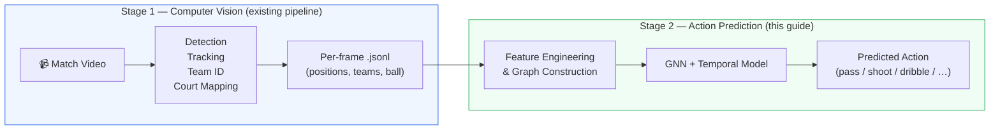
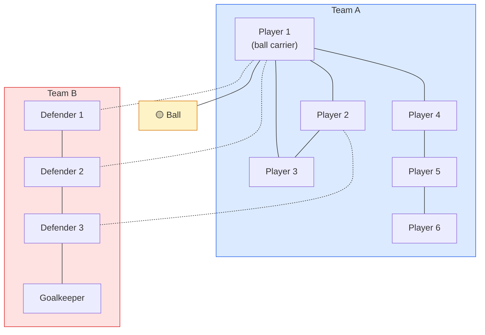
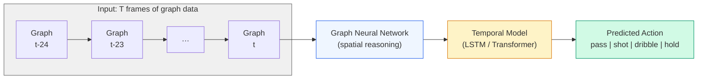
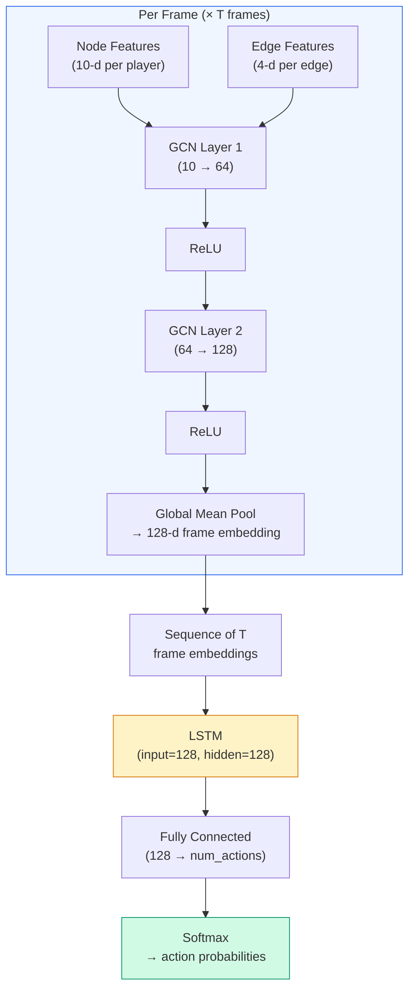
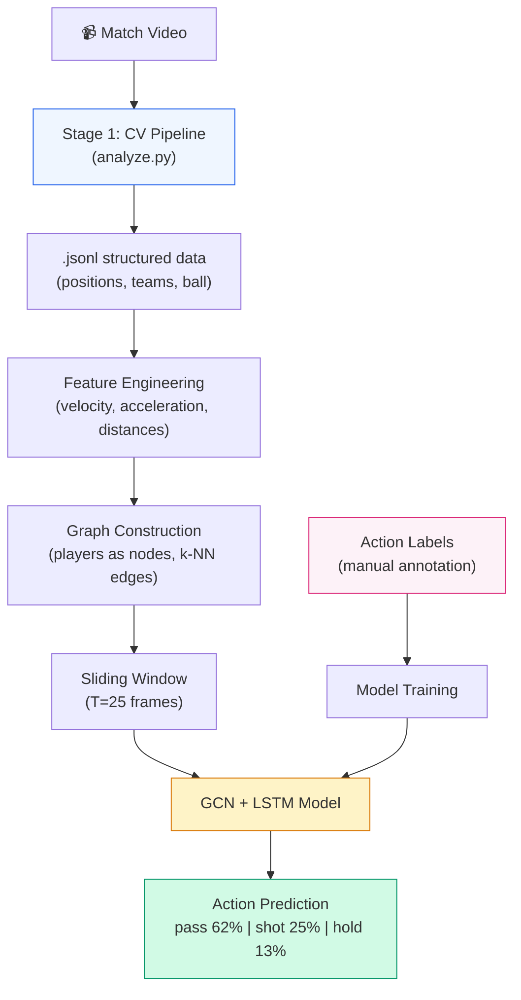

# Action Prediction Guide — From Structured Match Data to Tactical Forecasting

This guide describes the **second processing stage**: using the structured per-frame
data produced by the computer vision pipeline to train a machine learning model that
predicts what a player will do next (pass, shoot, dribble, etc.).

---

## 1. Two-Stage Architecture Overview

The full system is split into two independent stages. The first stage (computer vision)
runs offline on video and produces structured data. The second stage (prediction)
consumes that data and makes tactical predictions.



**Why two stages?**

- **Decoupled concerns** — CV deals with pixels, prediction deals with tactics
- **Different data formats** — Stage 1 input is video (images), Stage 2 input is structured tabular/graph data
- **Independent iteration** — you can improve detection without retraining the prediction model and vice versa
- **Reusability** — the same structured data can feed multiple downstream models (action prediction, formation analysis, player ratings, …)

---

## 2. The Prediction Problem

### What are we predicting?

Given a **sequence of recent frames** (e.g. the last 1–3 seconds), predict the
**next action** of the ball carrier or a specific player.

### Action classes (handball-specific)

| Action | Description |
|--------|-------------|
| `pass` | Player passes the ball to a teammate |
| `shot` | Player attempts a goal throw |
| `dribble` | Player moves with the ball (bouncing) |
| `hold` | Player holds the ball, scanning for options |
| `feint` | Player fakes a throw or direction change |
| `block` | Defensive player blocks an incoming shot |
| `intercept` | Player intercepts an opponent's pass |
| `screen` | Player sets a screen for a teammate |

> Start with 3–4 core classes (`pass`, `shot`, `dribble`, `hold`) and expand later.
> Rare actions can be grouped under `other` initially.

### Prediction horizon

- **Short-term (0.5–1s ahead)**: "Will this player shoot or pass?" — most actionable for tactical analysis
- **Medium-term (2–5s ahead)**: "What will the attack pattern be?" — requires sequence-to-sequence modeling

Start with short-term single-action classification.

---

## 3. Why Graphs? — Modeling Player Relationships

A handball scene is naturally a **graph**: players and the ball are entities (nodes)
connected by spatial and tactical relationships (edges). A flat feature vector
(just concatenating all positions) loses relational information that is critical
for predicting actions.

### Graph structure per frame



**Solid lines** = teammate relationships (same team)
**Dashed lines** = opponent relationships (nearby defenders)
**Ball edge** = possession link

### Node features (per player per frame)

| Feature | Source | Dimension |
|---------|--------|-----------|
| Court position (x, y) | `court_pos` from Stage 1 | 2 |
| Velocity (vx, vy) | Derived: position delta between frames | 2 |
| Acceleration (ax, ay) | Derived: velocity delta | 2 |
| Distance to ball | Euclidean distance to ball `court_pos` | 1 |
| Distance to goal | Distance to opponent's goal center (40,10) or (0,10) | 1 |
| Has ball | Binary: is this the ball carrier? | 1 |
| Team encoding | One-hot: Team A / Team B / Referee | 3 |
| Facing direction | Derived from pose keypoints (shoulders) if available | 2 |
| **Total** | | **~14** |

### Ball node features

| Feature | Source | Dimension |
|---------|--------|-----------|
| Court position (x, y) | `court_pos` | 2 |
| Velocity (vx, vy) | Position delta | 2 |
| Height estimate | Derived from bounding box size (smaller = higher) | 1 |

### Edge features

| Feature | Description | Dimension |
|---------|-------------|-----------|
| Distance | Euclidean distance between two nodes | 1 |
| Relative position (dx, dy) | Vector from node A to node B | 2 |
| Same team | Binary: are these two players on the same team? | 1 |
| Passing lane open | Binary: is the line between two teammates unobstructed by defenders? | 1 |

### Edge construction strategy

Not every pair of players needs an edge. Options:

1. **k-Nearest Neighbors (k-NN)**: connect each player to their k closest players (e.g. k=5)
2. **Distance threshold**: connect players within a radius (e.g. 8 metres)
3. **Full bipartite**: all teammates connected + all nearby opponents connected
4. **Hybrid**: full teammate connectivity + k-NN for opponents

> Start with **k-NN (k=5)** — simple and effective.

---

## 4. Temporal Modeling — Sequences of Graphs

A single frame is not enough to predict an action. The model needs **temporal context**:
a player accelerating toward the goal over the last 10 frames is likely to shoot.

### Spatio-Temporal Graph approach

Each timestep is a graph. The model processes a **sequence of T graphs**
(e.g. T=25 frames = 1 second at 25 FPS) and predicts the action at the end.



### Architecture options

| Architecture | Description | Complexity | Recommended |
|-------------|-------------|------------|-------------|
| **GNN → LSTM** | GNN encodes each frame's graph into a vector, LSTM processes the sequence | Medium | ✅ Start here |
| **GNN → Transformer** | Same, but Transformer for temporal attention | Medium-High | Good upgrade |
| **Spatio-Temporal GNN** | Single model handles both spatial and temporal edges (e.g. connecting same player across frames) | High | Research-grade |

**Recommended starting architecture: GCN + LSTM**

```
Per frame:
  Node features → GCN layer 1 → ReLU → GCN layer 2 → ReLU → Global pool → frame embedding (128-d)

Across frames:
  [frame_emb_t-24, ..., frame_emb_t] → LSTM (hidden=128) → FC → softmax → action class
```

---

## 5. Data Preparation

### 5.1 Input: structured data from Stage 1

The `.jsonl` file from the CV pipeline contains everything needed:

```python
import json
from pathlib import Path

frames = []
with open("output/match_states.jsonl") as f:
    for line in f:
        frames.append(json.loads(line))

print(f"Loaded {len(frames)} frames")
print(f"Players in frame 0: {len(frames[0]['players'])}")
```

### 5.2 Derived features

Compute velocity and acceleration from position deltas:

```python
import numpy as np

def add_dynamics(frames: list[dict], fps: float = 25.0) -> list[dict]:
    """Add velocity and acceleration to each player across frames."""
    dt = 1.0 / fps

    # Build position history per track_id
    history: dict[int, list[tuple[int, float, float]]] = {}
    for i, frame in enumerate(frames):
        for p in frame["players"]:
            if p.get("court_pos") is None:
                continue
            tid = p["track_id"]
            history.setdefault(tid, []).append((i, *p["court_pos"]))

    # Compute velocities
    velocities: dict[int, dict[int, tuple[float, float]]] = {}
    for tid, positions in history.items():
        velocities[tid] = {}
        for j in range(1, len(positions)):
            fi_prev, x0, y0 = positions[j - 1]
            fi_curr, x1, y1 = positions[j]
            n_frames = fi_curr - fi_prev
            if n_frames == 0:
                continue
            vx = (x1 - x0) / (n_frames * dt)
            vy = (y1 - y0) / (n_frames * dt)
            velocities[tid][fi_curr] = (vx, vy)

    # Attach to frame data
    for i, frame in enumerate(frames):
        for p in frame["players"]:
            tid = p["track_id"]
            if tid in velocities and i in velocities[tid]:
                p["velocity"] = velocities[tid][i]
            else:
                p["velocity"] = (0.0, 0.0)

    return frames
```

### 5.3 Action labels (annotation required)

This is the **main manual work** for Stage 2. You need to label actions in the video.

#### Option A: Label in a video tool

1. Open the match video in [CVAT](https://app.cvat.ai) or [Label Studio](https://labelstud.io)
2. Create a **video annotation task** with temporal labels
3. For each ball carrier, annotate the action they perform:
   - Mark the **start and end frame** of each action
   - Assign the action class (`pass`, `shot`, `dribble`, `hold`)
   - Note the `track_id` of the acting player
4. Export as JSON/CSV

#### Option B: Label from structured data

Use the `.jsonl` state data directly — write a small tool that steps through frames,
shows the court positions, and lets you label actions:

```python
# Minimal labeling loop (concept)
for i, frame in enumerate(frames):
    ball_carrier = find_ball_carrier(frame)  # nearest player to ball
    if ball_carrier:
        print(f"Frame {frame['frame_id']}: Player #{ball_carrier['track_id']} "
              f"at {ball_carrier['court_pos']} has ball")
        label = input("Action (p=pass, s=shot, d=dribble, h=hold, skip=Enter): ")
        if label:
            annotations.append({
                "frame_id": frame["frame_id"],
                "track_id": ball_carrier["track_id"],
                "action": {"p": "pass", "s": "shot", "d": "dribble", "h": "hold"}[label],
            })
```

#### How many labels do you need?

| Labels | Expected quality |
|--------|------------------|
| 200 | Proof of concept — may overfit |
| 500 | Reasonable baseline model |
| 1000+ | Solid model for 4 action classes |
| 3000+ | Strong model with rarer action classes |

> **Tip:** One full match (~60 min, 25 FPS) contains thousands of action moments.
> Labeling 2–3 full matches should provide enough data for a useful model.

### 5.4 Building training samples

Each training sample is a **window of T frames** ending at the frame where an action
is labeled:

```python
WINDOW_SIZE = 25  # 1 second at 25 FPS

def build_samples(frames, annotations, window_size=WINDOW_SIZE):
    samples = []
    frame_lookup = {f["frame_id"]: f for f in frames}

    for ann in annotations:
        fid = ann["frame_id"]
        # Collect window of frames ending at the action frame
        window = []
        for offset in range(window_size - 1, -1, -1):
            f = frame_lookup.get(fid - offset)
            if f is not None:
                window.append(f)

        if len(window) == window_size:
            samples.append({
                "frames": window,
                "action": ann["action"],
                "actor_track_id": ann["track_id"],
            })

    return samples
```

---

## 6. Graph Construction (PyTorch Geometric)

### 6.1 Install dependencies

```bash
uv add torch-geometric torch-scatter torch-sparse
```

### 6.2 Build a graph from one frame

```python
import torch
from torch_geometric.data import Data

GOAL_A = (0.0, 10.0)   # left goal center
GOAL_B = (40.0, 10.0)  # right goal center

def frame_to_graph(
    frame: dict,
    actor_track_id: int,
    k_neighbors: int = 5,
) -> Data:
    """Convert one frame's state data into a PyG graph."""

    players = [p for p in frame["players"] if p.get("court_pos") is not None]
    ball = frame.get("ball")
    ball_pos = ball["court_pos"] if ball and ball.get("court_pos") else (20.0, 10.0)

    node_features = []
    for p in players:
        cx, cy = p["court_pos"]
        vx, vy = p.get("velocity", (0.0, 0.0))
        dist_ball = ((cx - ball_pos[0])**2 + (cy - ball_pos[1])**2) ** 0.5
        dist_goal = ((cx - GOAL_B[0])**2 + (cy - GOAL_B[1])**2) ** 0.5
        has_ball = 1.0 if p["track_id"] == actor_track_id else 0.0
        team_a = 1.0 if p.get("team") == "A" else 0.0
        team_b = 1.0 if p.get("team") == "B" else 0.0
        is_ref = 1.0 if p.get("team") == "referee" else 0.0

        node_features.append([
            cx, cy, vx, vy,
            dist_ball, dist_goal, has_ball,
            team_a, team_b, is_ref,
        ])

    x = torch.tensor(node_features, dtype=torch.float)

    # Build k-NN edges based on court distance
    positions = torch.tensor(
        [p["court_pos"] for p in players], dtype=torch.float
    )
    dist_matrix = torch.cdist(positions, positions)

    edge_index = []
    edge_attr = []
    n = len(players)
    for i in range(n):
        # Get k nearest neighbors (excluding self)
        dists = dist_matrix[i].clone()
        dists[i] = float("inf")
        _, neighbors = dists.topk(min(k_neighbors, n - 1), largest=False)
        for j in neighbors:
            j = j.item()
            dx = positions[j][0] - positions[i][0]
            dy = positions[j][1] - positions[i][1]
            d = dist_matrix[i][j].item()
            same_team = 1.0 if players[i].get("team") == players[j].get("team") else 0.0
            edge_index.append([i, j])
            edge_attr.append([d, dx.item(), dy.item(), same_team])

    edge_index = torch.tensor(edge_index, dtype=torch.long).t().contiguous()
    edge_attr = torch.tensor(edge_attr, dtype=torch.float)

    return Data(x=x, edge_index=edge_index, edge_attr=edge_attr)
```

---

## 7. Model Architecture (GCN + LSTM)



### PyTorch implementation

```python
import torch
import torch.nn as nn
from torch_geometric.nn import GCNConv, global_mean_pool

class ActionPredictor(nn.Module):
    def __init__(
        self,
        node_features: int = 10,
        hidden_dim: int = 128,
        lstm_hidden: int = 128,
        num_actions: int = 4,
    ):
        super().__init__()
        # Spatial: GCN encodes each frame's graph
        self.gcn1 = GCNConv(node_features, 64)
        self.gcn2 = GCNConv(64, hidden_dim)

        # Temporal: LSTM over sequence of frame embeddings
        self.lstm = nn.LSTM(
            input_size=hidden_dim,
            hidden_size=lstm_hidden,
            batch_first=True,
        )

        # Classifier
        self.fc = nn.Linear(lstm_hidden, num_actions)
        self.relu = nn.ReLU()

    def encode_frame(self, data):
        """Encode a single frame graph into a fixed-size embedding."""
        x = self.relu(self.gcn1(data.x, data.edge_index))
        x = self.relu(self.gcn2(x, data.edge_index))
        # Global pool: mean of all node embeddings → single vector
        batch = data.batch if hasattr(data, "batch") and data.batch is not None \
            else torch.zeros(x.size(0), dtype=torch.long, device=x.device)
        return global_mean_pool(x, batch)  # (batch_size, hidden_dim)

    def forward(self, graph_sequence: list):
        """
        Args:
            graph_sequence: list of T PyG Data objects (one per frame)

        Returns:
            action logits (batch_size, num_actions)
        """
        # Encode each frame's graph
        embeddings = [self.encode_frame(g) for g in graph_sequence]
        # Stack into (batch, T, hidden_dim)
        seq = torch.stack(embeddings, dim=1)
        # LSTM over time
        lstm_out, _ = self.lstm(seq)
        # Use last hidden state
        last = lstm_out[:, -1, :]
        return self.fc(last)
```

---

## 8. Training Loop (Sketch)

```python
import torch.optim as optim

ACTION_MAP = {"pass": 0, "shot": 1, "dribble": 2, "hold": 3}
NUM_ACTIONS = len(ACTION_MAP)
WINDOW_SIZE = 25
EPOCHS = 50
LR = 1e-3

model = ActionPredictor(num_actions=NUM_ACTIONS)
optimizer = optim.Adam(model.parameters(), lr=LR)
criterion = nn.CrossEntropyLoss()

# samples = build_samples(frames, annotations)  # from Section 5.4

for epoch in range(EPOCHS):
    model.train()
    total_loss = 0

    for sample in samples:
        # Convert each frame in the window to a graph
        graphs = [
            frame_to_graph(f, sample["actor_track_id"])
            for f in sample["frames"]
        ]
        label = torch.tensor([ACTION_MAP[sample["action"]]])

        logits = model(graphs)
        loss = criterion(logits, label)

        optimizer.zero_grad()
        loss.backward()
        optimizer.step()
        total_loss += loss.item()

    print(f"Epoch {epoch+1}/{EPOCHS}  Loss: {total_loss / len(samples):.4f}")
```

> This is a simplified loop. A production version would add batching (via PyG's
> `DataLoader`), train/val/test splits, early stopping, and evaluation metrics.

---

## 9. Evaluation Metrics

| Metric | What it measures |
|--------|-----------------|
| **Accuracy** | Overall % of correct predictions |
| **Per-class F1** | Precision/recall balance per action (important because classes are imbalanced — shots are rarer than passes) |
| **Confusion matrix** | Where the model makes mistakes (e.g. confusing `hold` with `dribble`) |
| **Top-2 accuracy** | Is the correct action in the model's top 2 predictions? (useful for tactical analysis — "the player was likely to pass or shoot") |

---

## 10. End-to-End Pipeline

The full system from video to prediction:



---

## 11. Practical Roadmap

| Step | Effort | Description |
|------|--------|-------------|
| 1. Collect structured data | Low | Run Stage 1 pipeline on 3–5 matches |
| 2. Annotate actions | **High** | Label 500–1000+ actions in video (pass, shot, dribble, hold) |
| 3. Feature engineering | Medium | Compute velocities, distances, ball carrier detection |
| 4. Graph construction | Medium | Implement frame → PyG graph conversion |
| 5. Train baseline model | Medium | GCN + LSTM, train/val split, evaluate |
| 6. Iterate | Ongoing | Add features, tune hyperparameters, add action classes |

### Potential future extensions

- **Attention over players**: which teammates/opponents does the model "look at" when predicting? → tactical insights
- **Formation classification**: cluster graph structures to identify defensive/offensive formations
- **Expected goals (xG)**: predict shot success probability from the graph state
- **Sequence-to-sequence**: predict the next N actions, not just the next one

---

## 12. Key Libraries

| Library | Purpose |
|---------|---------|
| [PyTorch Geometric](https://pyg.org/) | Graph neural networks |
| [PyTorch](https://pytorch.org/) | Deep learning framework (already in the project) |
| [networkx](https://networkx.org/) | Graph visualization and analysis |
| [scikit-learn](https://scikit-learn.org/) | Evaluation metrics, baselines |
| [pandas](https://pandas.pydata.org/) | Tabular data manipulation |

```bash
# Install additional dependencies for Stage 2
uv add torch-geometric networkx pandas
```

---

## Summary

```
Stage 1 (CV):     Video  →  structured positions + teams + ball     (exists)
Stage 2 (ML):     Structured data  →  graphs  →  action prediction  (this guide)
```

The key insight: **the graph captures relationships** (who is near whom, who is on
which team, where are the passing lanes) that flat feature vectors would miss.
The temporal model (LSTM) captures **how those relationships evolve** over time,
which is what determines whether a player will pass, shoot, or hold.
