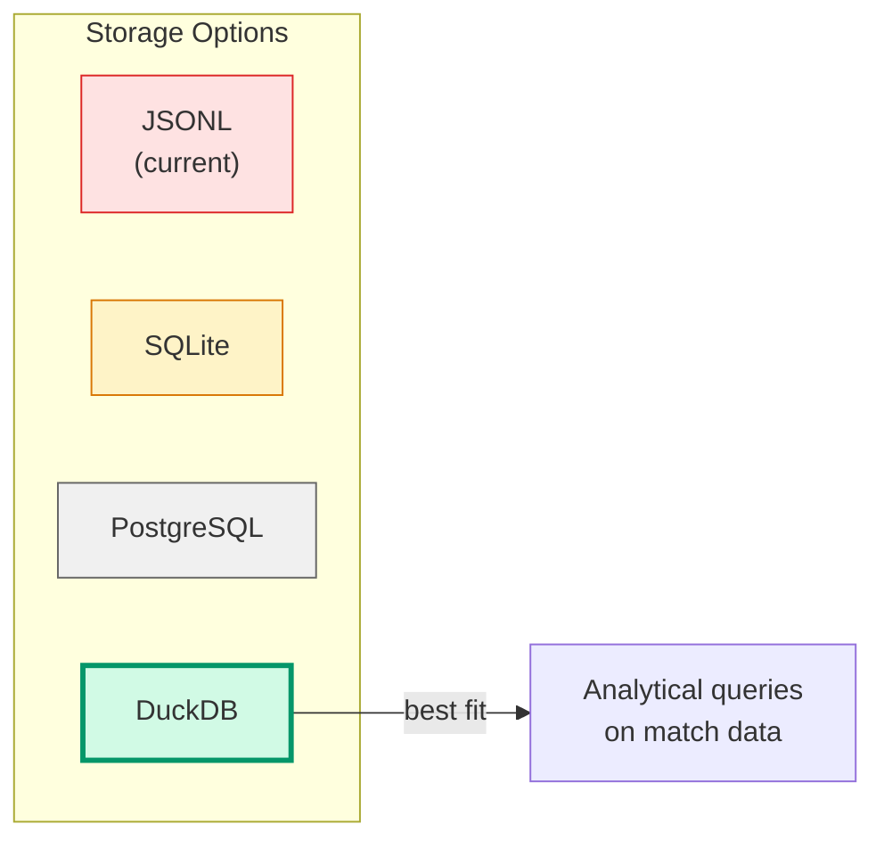
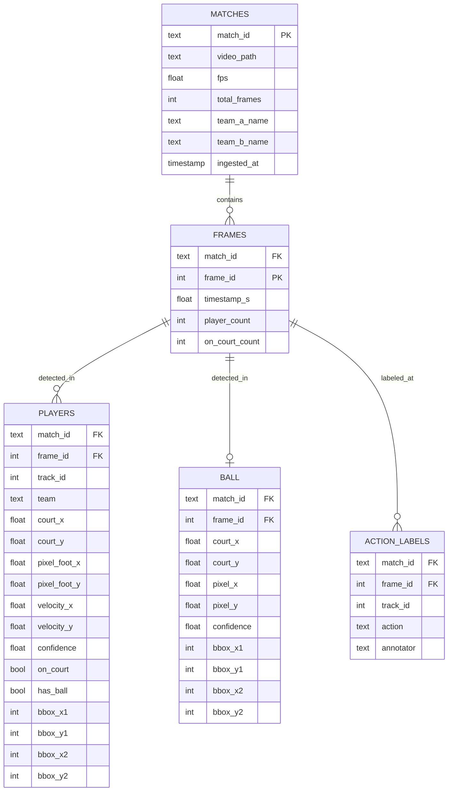
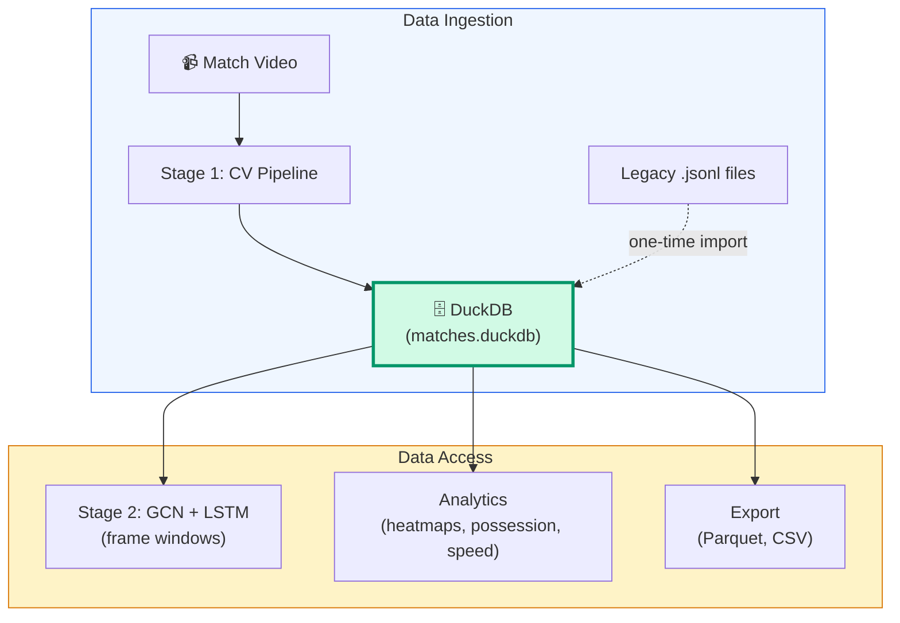

# Data Storage Guide — DuckDB for Match Data

This guide explains why and how to use **DuckDB** as the central data store for
structured match data produced by the CV pipeline (Stage 1) and consumed by
downstream models (Stage 2).

---

## 1. Why Not JSONL?

The current pipeline writes one `.jsonl` file per match — one JSON object per line,
one line per frame. This works for a single-match POC but breaks down at scale:

| Problem | Impact |
|---------|--------|
| **No indexing** | "Give me frames 5000–5025 from match 3" requires scanning the entire file |
| **No schema** | A missing field in one frame silently breaks Stage 2 |
| **No cross-match queries** | "All shots across all matches" means loading every file into memory |
| **Append-only** | Correcting one frame means rewriting the whole file |
| **No types** | Everything is a string until you parse it |
| **Duplicated reads** | Every consumer re-parses the same JSON from scratch |

At 25 FPS × 60 min × 15 players = **~1.35 million player-frame rows per match**.
With 5–10 matches, JSONL becomes a bottleneck for both I/O and developer ergonomics.

---

## 2. Why DuckDB?



| | JSONL | SQLite | PostgreSQL | **DuckDB** |
|---|---|---|---|---|
| Server needed | No | No | Yes | **No** |
| Single file | Yes | Yes | No | **Yes** |
| Nested data (player arrays) | Native | Awkward (JOINs or JSON blobs) | JSON columns | **Native STRUCT/LIST** |
| Window queries (frames N to N+25) | Full scan | Fast (indexed) | Fast | **Very fast** |
| Cross-match analytics | Load all files | Good | Good | **Excellent** |
| Columnar storage | No | No | No | **Yes** |
| Aggregations (avg speed, count shots) | Slow | OK | Good | **Very fast** |
| Python integration | `json` stdlib | `sqlite3` stdlib | psycopg2 | **`duckdb` (pip)** |
| Reads existing JSONL | — | No | No | **Yes, natively** |
| Setup effort | Zero | Low | High | **Low** |

**DuckDB is "SQLite for analytics"** — single file, zero config, no server, but
columnar and optimized for the exact query patterns Stage 2 needs:
scanning time windows, aggregating across matches, and filtering by team/player/action.

### Installation

```bash
uv add duckdb
```

---

## 3. Database Schema

The schema denormalizes the nested JSONL structure into flat, query-friendly tables.



### SQL table definitions

```sql
CREATE TABLE IF NOT EXISTS matches (
    match_id       TEXT PRIMARY KEY,   -- e.g. '2026-03-15_wels_vs_linz'
    video_path     TEXT,
    fps            DOUBLE,
    total_frames   INTEGER,
    team_a_name    TEXT,
    team_b_name    TEXT,
    ingested_at    TIMESTAMP DEFAULT current_timestamp
);

CREATE TABLE IF NOT EXISTS frames (
    match_id       TEXT NOT NULL,
    frame_id       INTEGER NOT NULL,
    timestamp_s    DOUBLE,
    player_count   INTEGER,
    on_court_count INTEGER,
    PRIMARY KEY (match_id, frame_id)
);

CREATE TABLE IF NOT EXISTS players (
    match_id       TEXT NOT NULL,
    frame_id       INTEGER NOT NULL,
    track_id       INTEGER NOT NULL,
    team           TEXT,              -- 'A', 'B', 'referee', 'unknown'
    court_x        DOUBLE,           -- court metres (NULL if no homography)
    court_y        DOUBLE,
    pixel_foot_x   DOUBLE,
    pixel_foot_y   DOUBLE,
    velocity_x     DOUBLE DEFAULT 0,
    velocity_y     DOUBLE DEFAULT 0,
    confidence     DOUBLE,
    on_court       BOOLEAN DEFAULT TRUE,
    has_ball       BOOLEAN DEFAULT FALSE,
    bbox_x1        INTEGER,
    bbox_y1        INTEGER,
    bbox_x2        INTEGER,
    bbox_y2        INTEGER,
    PRIMARY KEY (match_id, frame_id, track_id)
);

CREATE TABLE IF NOT EXISTS ball (
    match_id       TEXT NOT NULL,
    frame_id       INTEGER NOT NULL,
    court_x        DOUBLE,
    court_y        DOUBLE,
    pixel_x        DOUBLE,
    pixel_y        DOUBLE,
    confidence     DOUBLE,
    bbox_x1        INTEGER,
    bbox_y1        INTEGER,
    bbox_x2        INTEGER,
    bbox_y2        INTEGER,
    PRIMARY KEY (match_id, frame_id)
);

CREATE TABLE IF NOT EXISTS action_labels (
    match_id       TEXT NOT NULL,
    frame_id       INTEGER NOT NULL,
    track_id       INTEGER NOT NULL,
    action         TEXT NOT NULL,     -- 'pass', 'shot', 'dribble', 'hold', ...
    annotator      TEXT DEFAULT 'manual',
    PRIMARY KEY (match_id, frame_id, track_id)
);

-- Indexes for common Stage 2 query patterns
CREATE INDEX IF NOT EXISTS idx_players_window
    ON players (match_id, frame_id);

CREATE INDEX IF NOT EXISTS idx_ball_window
    ON ball (match_id, frame_id);

CREATE INDEX IF NOT EXISTS idx_labels_action
    ON action_labels (action);
```

---

## 4. Importing Existing JSONL Data

DuckDB can read JSONL files natively — no manual parsing needed.

```python
import duckdb

db = duckdb.connect("matches.duckdb")

def import_jsonl(jsonl_path: str, match_id: str):
    """Import an existing .jsonl state file into DuckDB."""

    # Load raw JSONL
    raw = db.execute(
        "SELECT * FROM read_json_auto(?)", [jsonl_path]
    ).fetchdf()

    # Insert frames
    db.execute("""
        INSERT INTO frames (match_id, frame_id, timestamp_s, player_count, on_court_count)
        SELECT ?, frame_id, timestamp_s, player_count, on_court_count
        FROM read_json_auto(?)
    """, [match_id, jsonl_path])

    # Flatten players from nested arrays
    db.execute("""
        INSERT INTO players
            (match_id, frame_id, track_id, team, court_x, court_y,
             pixel_foot_x, pixel_foot_y, confidence, on_court,
             bbox_x1, bbox_y1, bbox_x2, bbox_y2)
        SELECT
            ? AS match_id,
            f.frame_id,
            p.track_id,
            p.team,
            p.court_pos[1],
            p.court_pos[2],
            p.foot_px[1],
            p.foot_px[2],
            p.conf,
            p.on_court,
            p.bbox[1],
            p.bbox[2],
            p.bbox[3],
            p.bbox[4]
        FROM read_json_auto(?) f,
             UNNEST(f.players) AS p
    """, [match_id, jsonl_path])

    # Flatten ball data
    db.execute("""
        INSERT INTO ball
            (match_id, frame_id, court_x, court_y, pixel_x, pixel_y,
             confidence, bbox_x1, bbox_y1, bbox_x2, bbox_y2)
        SELECT
            ? AS match_id,
            f.frame_id,
            f.ball.court_pos[1],
            f.ball.court_pos[2],
            f.ball.center_px[1],
            f.ball.center_px[2],
            f.ball.conf,
            f.ball.bbox[1],
            f.ball.bbox[2],
            f.ball.bbox[3],
            f.ball.bbox[4]
        FROM read_json_auto(?) f
        WHERE f.ball IS NOT NULL
    """, [match_id, jsonl_path])

    print(f"Imported {match_id} from {jsonl_path}")

# Usage
import_jsonl("output/video2_states.jsonl", "2026-03-15_wels_vs_linz")
```

---

## 5. Writing Directly from the Pipeline

Instead of writing JSONL, the pipeline can write to DuckDB directly. This replaces
the `StateExporter` class in `pipeline/state.py`.

```python
import duckdb
from pathlib import Path


class DuckDBExporter:
    """Write per-frame state data directly into DuckDB."""

    def __init__(self, db_path: Path, match_id: str):
        self._db = duckdb.connect(str(db_path))
        self._match_id = match_id
        self._init_tables()

    def _init_tables(self):
        """Create tables if they don't exist."""
        self._db.execute("""
            CREATE TABLE IF NOT EXISTS frames (
                match_id TEXT, frame_id INTEGER, timestamp_s DOUBLE,
                player_count INTEGER, on_court_count INTEGER,
                PRIMARY KEY (match_id, frame_id)
            );
            CREATE TABLE IF NOT EXISTS players (
                match_id TEXT, frame_id INTEGER, track_id INTEGER,
                team TEXT, court_x DOUBLE, court_y DOUBLE,
                pixel_foot_x DOUBLE, pixel_foot_y DOUBLE,
                velocity_x DOUBLE, velocity_y DOUBLE,
                confidence DOUBLE, on_court BOOLEAN, has_ball BOOLEAN,
                bbox_x1 INTEGER, bbox_y1 INTEGER,
                bbox_x2 INTEGER, bbox_y2 INTEGER,
                PRIMARY KEY (match_id, frame_id, track_id)
            );
            CREATE TABLE IF NOT EXISTS ball (
                match_id TEXT, frame_id INTEGER,
                court_x DOUBLE, court_y DOUBLE,
                pixel_x DOUBLE, pixel_y DOUBLE,
                confidence DOUBLE,
                bbox_x1 INTEGER, bbox_y1 INTEGER,
                bbox_x2 INTEGER, bbox_y2 INTEGER,
                PRIMARY KEY (match_id, frame_id)
            );
            CREATE TABLE IF NOT EXISTS action_labels (
                match_id TEXT, frame_id INTEGER, track_id INTEGER,
                action TEXT, annotator TEXT DEFAULT 'manual',
                PRIMARY KEY (match_id, frame_id, track_id)
            );
        """)

    def write(self, state: dict):
        """Write one frame's state to DuckDB."""
        mid = self._match_id
        fid = state["frame_id"]

        self._db.execute(
            "INSERT INTO frames VALUES (?, ?, ?, ?, ?)",
            [mid, fid, state["timestamp_s"],
             state["player_count"], state["on_court_count"]],
        )

        for p in state["players"]:
            court_x = p["court_pos"][0] if p.get("court_pos") else None
            court_y = p["court_pos"][1] if p.get("court_pos") else None
            self._db.execute(
                "INSERT INTO players VALUES (?,?,?,?,?,?,?,?,?,?,?,?,?,?,?,?,?)",
                [mid, fid, p["track_id"], p["team"],
                 court_x, court_y,
                 p["foot_px"][0], p["foot_px"][1],
                 0, 0,  # velocity computed in post-processing
                 p["conf"], p["on_court"], False,
                 p["bbox"][0], p["bbox"][1], p["bbox"][2], p["bbox"][3]],
            )

        if state.get("ball"):
            b = state["ball"]
            court_x = b["court_pos"][0] if b.get("court_pos") else None
            court_y = b["court_pos"][1] if b.get("court_pos") else None
            self._db.execute(
                "INSERT INTO ball VALUES (?,?,?,?,?,?,?,?,?,?,?)",
                [mid, fid, court_x, court_y,
                 b["center_px"][0], b["center_px"][1], b["conf"],
                 b["bbox"][0], b["bbox"][1], b["bbox"][2], b["bbox"][3]],
            )

    def close(self):
        self._db.close()
```

---

## 6. Computing Derived Features (Velocity, Ball Carrier)

Once data is in DuckDB, derived features can be computed with SQL — no Python loops.

### Velocity from position deltas

```sql
-- Add velocity as the position change between consecutive frames
UPDATE players p
SET velocity_x = sub.vx, velocity_y = sub.vy
FROM (
    SELECT
        match_id, frame_id, track_id,
        (court_x - LAG(court_x) OVER w) /
            NULLIF(frame_id - LAG(frame_id) OVER w, 0) * 25.0 AS vx,
        (court_y - LAG(court_y) OVER w) /
            NULLIF(frame_id - LAG(frame_id) OVER w, 0) * 25.0 AS vy
    FROM players
    WINDOW w AS (PARTITION BY match_id, track_id ORDER BY frame_id)
) sub
WHERE p.match_id = sub.match_id
  AND p.frame_id = sub.frame_id
  AND p.track_id = sub.track_id;
```

### Detect ball carrier (nearest player to ball)

```sql
-- Mark the closest player to the ball in each frame as has_ball = TRUE
UPDATE players p
SET has_ball = TRUE
FROM (
    SELECT DISTINCT ON (pl.match_id, pl.frame_id)
        pl.match_id, pl.frame_id, pl.track_id
    FROM players pl
    JOIN ball b ON pl.match_id = b.match_id AND pl.frame_id = b.frame_id
    WHERE pl.court_x IS NOT NULL AND b.court_x IS NOT NULL
    ORDER BY pl.match_id, pl.frame_id,
             (pl.court_x - b.court_x)^2 + (pl.court_y - b.court_y)^2
) sub
WHERE p.match_id = sub.match_id
  AND p.frame_id = sub.frame_id
  AND p.track_id = sub.track_id;
```

---

## 7. Querying for Stage 2 (Graph Construction)

These are the queries the GCN + LSTM pipeline needs.

### Load a frame window for graph construction

```python
import duckdb

db = duckdb.connect("matches.duckdb", read_only=True)

def load_window(match_id: str, center_frame: int, window: int = 25):
    """Load T frames of player + ball data for graph construction."""
    start = center_frame - window + 1

    players_df = db.execute("""
        SELECT frame_id, track_id, team, court_x, court_y,
               velocity_x, velocity_y, has_ball, confidence
        FROM players
        WHERE match_id = ? AND frame_id BETWEEN ? AND ?
          AND court_x IS NOT NULL
        ORDER BY frame_id, track_id
    """, [match_id, start, center_frame]).fetchdf()

    ball_df = db.execute("""
        SELECT frame_id, court_x, court_y
        FROM ball
        WHERE match_id = ? AND frame_id BETWEEN ? AND ?
        ORDER BY frame_id
    """, [match_id, start, center_frame]).fetchdf()

    # Group into per-frame dicts
    frames = []
    for fid in range(start, center_frame + 1):
        p_frame = players_df[players_df.frame_id == fid]
        b_frame = ball_df[ball_df.frame_id == fid]
        frames.append({
            "frame_id": fid,
            "players": p_frame.to_dict("records"),
            "ball": b_frame.iloc[0].to_dict() if len(b_frame) > 0 else None,
        })

    return frames
```

### Load all training samples (action labels + windows)

```python
def load_training_samples(window: int = 25):
    """Load all labeled actions with their corresponding frame windows."""
    labels = db.execute("""
        SELECT match_id, frame_id, track_id, action
        FROM action_labels
        ORDER BY match_id, frame_id
    """).fetchdf()

    samples = []
    for _, row in labels.iterrows():
        frames = load_window(row.match_id, row.frame_id, window)
        if len(frames) == window:
            samples.append({
                "frames": frames,
                "action": row.action,
                "actor_track_id": row.track_id,
            })

    return samples
```

---

## 8. Analytical Queries (for the Trainer)

DuckDB makes it easy to answer tactical questions directly with SQL.

### Player heatmap data

```sql
-- Position density for a specific player across a match
SELECT
    ROUND(court_x, 0) AS zone_x,
    ROUND(court_y, 0) AS zone_y,
    COUNT(*) AS time_in_zone
FROM players
WHERE match_id = '2026-03-15_wels_vs_linz'
  AND track_id = 7
  AND on_court = TRUE
GROUP BY zone_x, zone_y
ORDER BY time_in_zone DESC;
```

### Team speed comparison

```sql
SELECT
    team,
    AVG(SQRT(velocity_x^2 + velocity_y^2)) AS avg_speed_ms,
    MAX(SQRT(velocity_x^2 + velocity_y^2)) AS max_speed_ms
FROM players
WHERE match_id = '2026-03-15_wels_vs_linz'
  AND on_court = TRUE
  AND team IN ('A', 'B')
GROUP BY team;
```

### Ball possession by team

```sql
SELECT
    p.team,
    COUNT(*) AS frames_with_ball,
    ROUND(COUNT(*) * 100.0 / SUM(COUNT(*)) OVER (), 1) AS possession_pct
FROM players p
WHERE p.has_ball = TRUE
  AND p.match_id = '2026-03-15_wels_vs_linz'
  AND p.team IN ('A', 'B')
GROUP BY p.team;
```

### Shot frequency by court zone

```sql
SELECT
    CASE
        WHEN p.court_x < 9 THEN 'left_6m'
        WHEN p.court_x < 15 THEN 'left_wing'
        WHEN p.court_x < 25 THEN 'center'
        WHEN p.court_x < 31 THEN 'right_wing'
        ELSE 'right_6m'
    END AS zone,
    COUNT(*) AS shots
FROM action_labels a
JOIN players p USING (match_id, frame_id, track_id)
WHERE a.action = 'shot'
GROUP BY zone
ORDER BY shots DESC;
```

### Cross-match statistics

```sql
-- Action distribution across all ingested matches
SELECT
    m.match_id,
    a.action,
    COUNT(*) AS count
FROM action_labels a
JOIN matches m USING (match_id)
GROUP BY m.match_id, a.action
ORDER BY m.match_id, count DESC;
```

---

## 9. Data Sizes

Estimating storage for a typical match at 25 FPS, 60 minutes, ~14 players visible:

| Table | Rows per match | Row size (approx.) | Total |
|-------|---------------|-------------------|-------|
| `frames` | 90,000 | ~40 bytes | 3.6 MB |
| `players` | 1,260,000 | ~130 bytes | 164 MB |
| `ball` | 90,000 | ~90 bytes | 8.1 MB |
| **Total** | | | **~175 MB** |

With DuckDB's columnar compression, actual on-disk size will be **50–80 MB per match**.
10 matches ≈ 500–800 MB. Easily fits on disk and in RAM.

---

## 10. File Structure

```
project/
├── matches.duckdb          ← single database file (all matches)
├── output/
│   └── video2_states.jsonl ← legacy JSONL (import once, then optional)
├── pipeline/
│   └── state.py            ← DuckDBExporter replaces StateExporter
└── scripts/
    └── import_jsonl.py     ← one-time migration from JSONL
```

---

## 11. Backup & Portability

```python
# Export to Parquet (efficient, portable, readable by pandas/Spark/DuckDB)
db.execute("COPY players TO 'export/players.parquet' (FORMAT PARQUET)")
db.execute("COPY ball TO 'export/ball.parquet' (FORMAT PARQUET)")

# Export to CSV (human-readable)
db.execute("COPY players TO 'export/players.csv' (HEADER, DELIMITER ',')")

# Full database backup
db.execute("EXPORT DATABASE 'backup/' (FORMAT PARQUET)")
```

---

## Summary



| JSONL (before) | DuckDB (after) |
|---|---|
| Parse entire file for any query | Indexed, instant lookups |
| One file per match, no cross-match queries | Single file, SQL across all matches |
| No schema — silent failures | Typed columns — errors caught at insert |
| Joins/aggregations in Python loops | Native SQL window functions and aggregations |
| No derived features stored | Velocity, ball carrier computed in-place with SQL |
