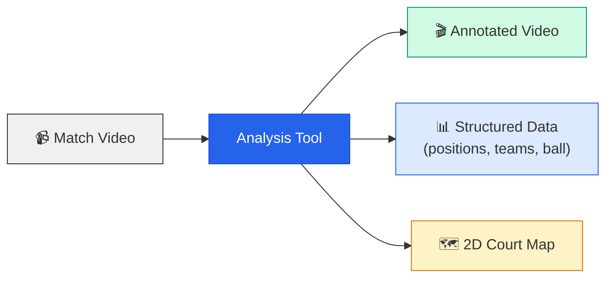
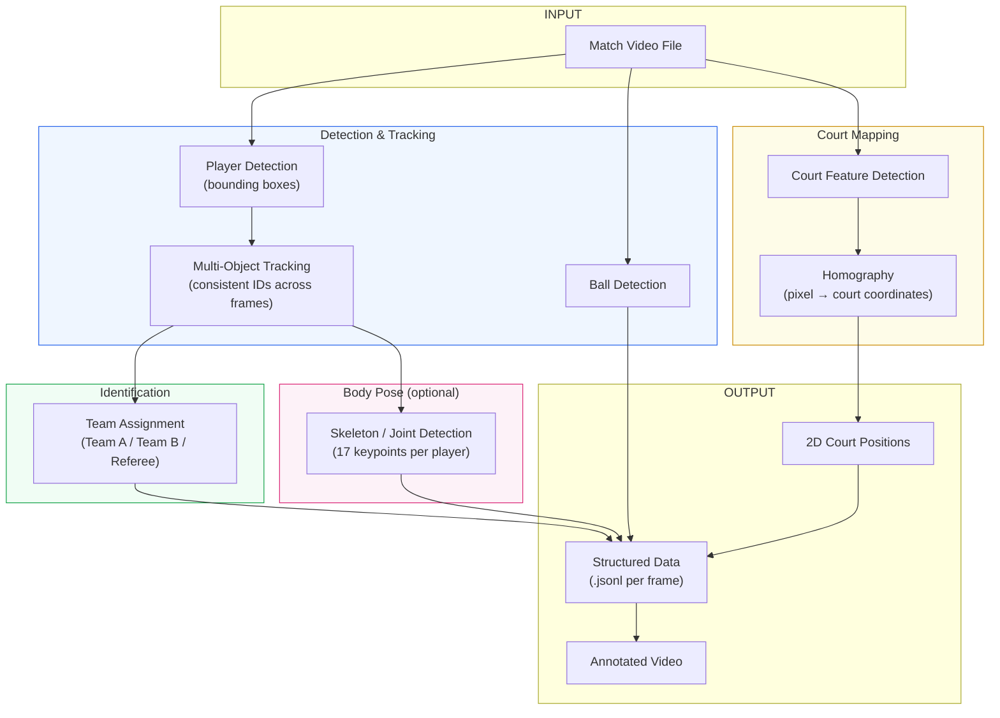
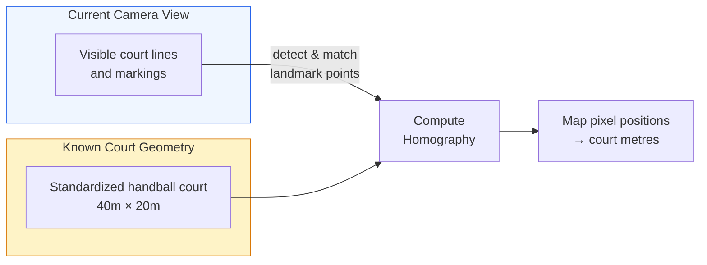
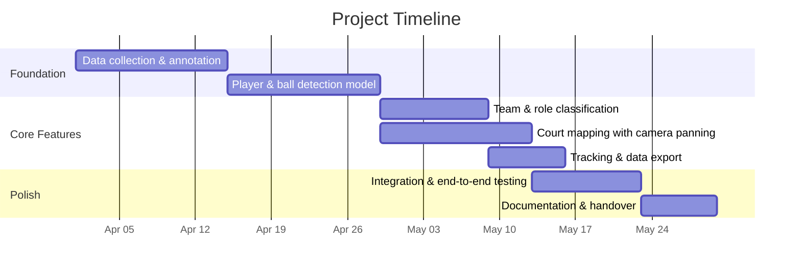

# Project Proposal — Handball Match Video Analysis Tool

## 1. Background

Handball coaches today rely on manual video review to analyze matches after the fact.
A trainer watches full game recordings, mentally tracks player positions, ball movement,
and team formations — then tries to reconstruct what happened and why. This process is
**time-consuming, subjective, and error-prone**. Key tactical patterns are easy to miss
when 14 field players, referees, and a fast-moving ball are all in play simultaneously.

There is no affordable, accessible tool tailored to handball that automatically extracts
structured match data from standard broadcast or sideline camera footage.

## 2. Problem Statement

A handball trainer needs to **review and analyze completed matches** to adjust team
strategy for future games. Specifically, the trainer wants to answer questions like:

- Where were my players positioned during key phases of the game?
- How did our defensive formation hold up against the opponent's attack patterns?
- Which players moved effectively, and which were out of position?
- Where was the ball, and how did possession flow between players?
- How did the opponent's formation change over the course of the match?

Currently, answering these questions requires **hours of manual video review** per match
with no structured data output — only notes and memory.

## 3. Proposed Solution

We propose a **video analysis tool** that takes a standard match recording as input and
automatically produces structured, frame-by-frame match data and annotated video output.

The tool uses **computer vision and machine learning** (specifically, state-of-the-art
object detection models) to detect players, identify teams, track the ball, and map
positions onto a 2D court representation — all from a single video file.

### What the trainer gets

| Output | Description |
|--------|-------------|
| **Annotated video** | Original footage overlaid with player bounding boxes, team colors, tracking IDs, and ball position |
| **2D court map** | Player and ball positions mapped onto a top-down handball court diagram (40m × 20m) |
| **Structured data export** | Per-frame JSON data with all player positions, team assignments, ball location, and court coordinates — ready for further analysis or visualization |

### High-Level Workflow



## 4. Technical Approach

The tool is built as an automated pipeline that processes each video frame through
several stages:



### Key technologies

| Component | Technology | Purpose |
|-----------|-----------|---------|
| Object detection | YOLO11 (deep learning model) | Detect players and ball in each frame |
| Tracking | ByteTrack algorithm | Maintain consistent player IDs across frames |
| Team classification | Color analysis or trained classifier | Distinguish Team A, Team B, and referees |
| Court mapping | Homography transformation | Convert pixel positions to real-world court coordinates (metres) |
| Pose estimation | YOLO11-Pose (optional) | Detect body joint positions for movement analysis |

### Handling camera movement

Handball broadcasts use a **panning camera** that follows the ball — the full court is
never visible in a single frame. To map player positions onto a 2D court despite this,
the tool detects **visible court markings** (lines, arcs, intersections) in each frame
and computes a frame-by-frame coordinate transformation. The handball court's standardized
dimensions (40m × 20m, 6m goal area, 9m free-throw line, center line) provide the
fixed reference points.



## 5. Expected Result

After processing a match video, the trainer receives:

### 5.1 Annotated Video

The original match footage with overlaid visual information:
- Colored bounding boxes around each player (color-coded by team)
- Persistent player tracking numbers
- Ball position highlighted
- Team labels (A / B / Referee)
- Optional: skeleton overlay showing body pose

### 5.2 Structured Match Data

A machine-readable file (JSON) containing **one record per frame** with:

```json
{
    "frame_id": 1500,
    "timestamp_s": 50.0,
    "ball": {
        "court_pos": [22.5, 11.3]
    },
    "players": [
        {
            "track_id": 3,
            "team": "A",
            "court_pos": [15.2, 8.7],
            "on_court": true
        },
        {
            "track_id": 7,
            "team": "B",
            "court_pos": [28.1, 12.4],
            "on_court": true
        }
    ]
}
```

This data can be loaded into any analysis or visualization tool for further use — for
example, generating heatmaps, reconstructing attack/defense formations, or computing
player movement statistics.

### 5.3 2D Court Overview

Player and ball positions projected onto a top-down court diagram, enabling the trainer
to see **team formations at any point in the match** without watching the video.

```
+------------------------------------------------------+
|                                                      |
|        ○ 3        ○ 5                                |
|    ○ 2                      ● 9                      |
|  ╭───╮          ◉             ○ 11    ╭───╮         |
|  │   │    ○ 4          ● 8           │   │         |
|  ╰───╯       ○ 7              ● 10   ╰───╯         |
|                    ● 12                              |
|         ○ 6                     ● 13                 |
|                                                      |
+------------------------------------------------------+
         ○ = Team A    ● = Team B    ◉ = Ball
```

## 6. Scope & Deliverables

| # | Deliverable | Description |
|---|-------------|-------------|
| 1 | **Analysis pipeline** | Command-line tool: input a video → output annotated video + structured data |
| 2 | **Player & ball detection** | Trained model detecting players and handballs with team/role classification |
| 3 | **Court mapping** | Pixel-to-court coordinate transformation handling camera panning |
| 4 | **Data export** | Per-frame JSON export of all tracked objects and positions |
| 5 | **Annotated video** | Video output with visual overlays (boxes, team colors, ball marker) |
| 6 | **Documentation** | User guide for running the tool and interpreting the output |

### Out of scope (for this phase)

- Real-time / live analysis during a match
- Automatic tactical pattern recognition (e.g. "7 vs 6 attack detected")
- Web-based user interface (output is file-based)
- Multi-camera fusion
- Automatic highlight generation

## 7. Timeline (3 Months)



| Phase | Duration | Focus |
|-------|----------|-------|
| **Foundation** (Weeks 1–4) | 4 weeks | Collect and annotate training data, train detection model for players + ball |
| **Core Features** (Weeks 5–8) | 4 weeks | Team classification, court mapping with panning support, tracking, data export |
| **Polish** (Weeks 9–12) | 4 weeks | End-to-end pipeline integration, testing on full matches, documentation |

## 8. Requirements from the Customer

To deliver a well-performing tool, we need:

| Requirement | Details |
|-------------|---------|
| **Match recordings** | 3–5 full match videos (standard broadcast or sideline camera) |
| **Video quality** | Minimum 720p resolution, 25+ FPS |
| **Jersey colors** | Information about team jersey colors for each match |
| **Feedback sessions** | 2–3 intermediate review meetings to validate detection quality and output format |

## 9. Assumptions & Constraints

- The tool processes **pre-recorded video** (not live streams)
- Processing requires a computer with a **dedicated GPU** (NVIDIA, for model inference)
- Detection accuracy depends on video quality — low resolution, heavy motion blur, or extreme camera angles will reduce performance
- Court mapping accuracy depends on **visible court lines** in each frame — if the camera is zoomed in too tightly (e.g. close-up shots), positions cannot be mapped for those frames
- Team classification works best when jersey colors are **clearly distinct** between the two teams
